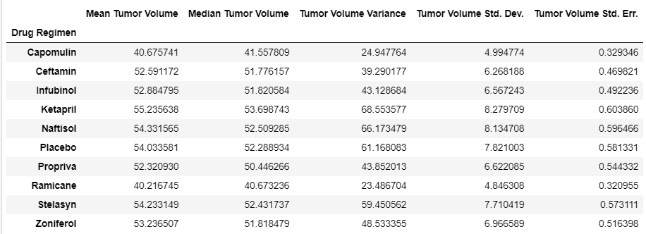
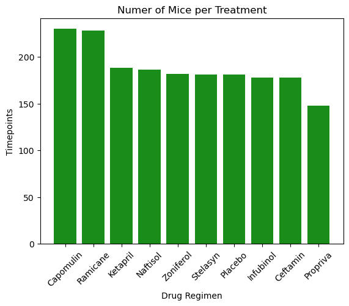
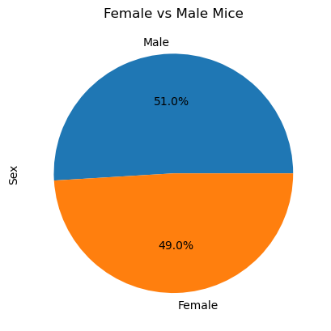
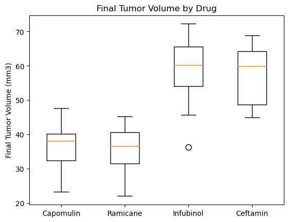
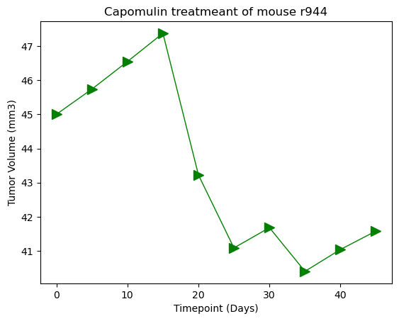
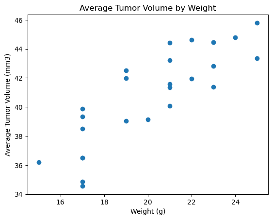

# Data_V_Challenge

## Pymaceuticals Inc.

Pymaceuticals, Inc. is a new company that specializes in anti-cancer medications. Recently, it began screening for potential treatments for squamous cell carcinoma (SCC), a commonly occurring form of skin cancer. I've been given access to the complete data from their most recent animal study.
249 mice who were identified with SCC tumors received treatment with a range of drug Regimens. Over the course of 45 days, tumor development was observed and measured. 
The purpose of this study was to compare the performance of Pymaceuticals’ drug of interest, Capomulin, against the other treatment Regimens.

Final results with the following visualization were colculated:

* Summary statistics table

 

* Bar Plot shows the total number of Timepoints for all mice for each drug Regiman of the study course

 

* Pie chart shows the distribution of female vs male mice in the study

 

* Box plot of the final tumor volume for all four treatment regimens

 

* Line plot of volume versus timepoint for Capomulin treatmeant of mouse r944

 

* Scatter plot of tumor volume vs mouse weight for the Capomulin treatment regimen

 

*  The correlation coefficient and the  liner regression  model  for mouse weight and average observed tumor volume for the entire Capomulin regimen

The correlation between mouse weight and the average tumor volume is 0.84

## Observations 

* Capomulin and Ramicane reduces the tumor size much better then other drugs.  Also shows that the most number of mice tested by its.

* The correlation between mouse weight and the average tumor volume is 0.84. It is positive. It tells us that if the mouse weight increases, the average tomor volume increases too. 

